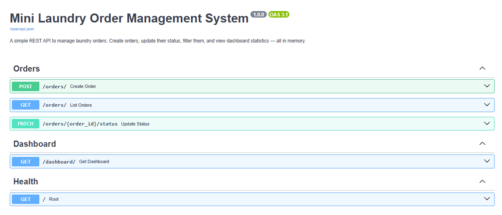
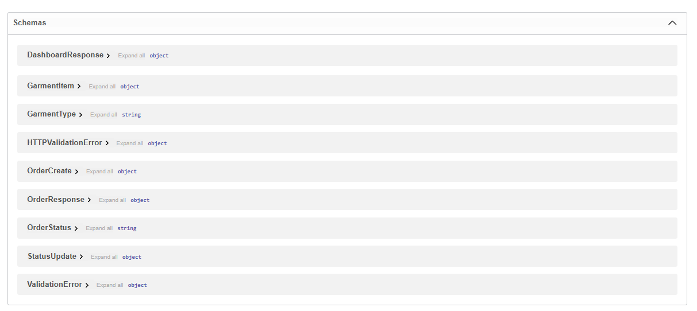
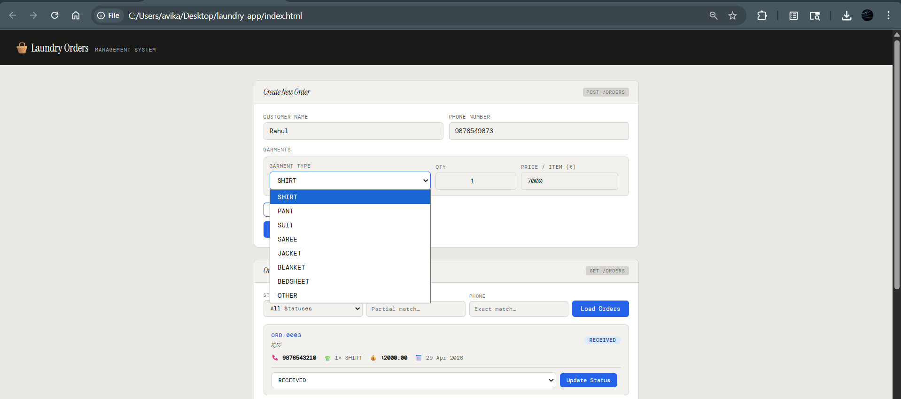
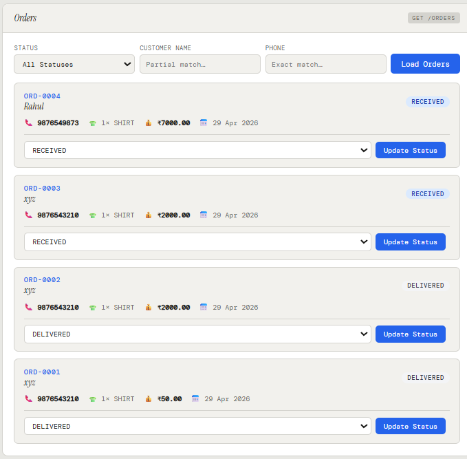
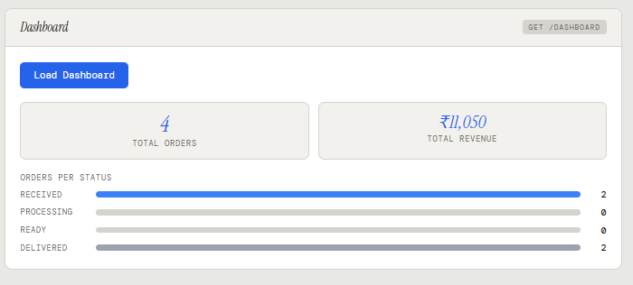

# 🧺 Mini Laundry Order Management System

A clean, minimal REST API built with **FastAPI** + **in-memory storage** (no database needed).

---

## Project Structure

```
laundry_app/
├── index.html
├── assets/                    # Screenshots used in README
│ ├── create_new_order.png
│ ├── dashboard.png
│ ├── endpoints_overview.png
│ ├── orders.png
│ └── schemas_models.png
├── app/
│   ├── main.py               # FastAPI app, middleware, router registration
│   ├── models.py             # Pydantic schemas (request/response shapes)
│   ├── db/
│   │   └── store.py          # In-memory dictionary (our "database")
│   ├── services/
│   │   └── order_service.py  # Business logic (create, list, update, stats)
│   └── routes/
│       ├── orders.py         # POST /orders, GET /orders, PATCH /orders/{id}/status
│       └── dashboard.py      # GET /dashboard
├── requirements.txt
└── README.md
```

---

## Setup & Run

### 1. Clone / unzip the project

```bash
cd laundry_app
```

### 2. Create a virtual environment (recommended)

```bash
python -m venv venv
source venv/bin/activate        # Linux / macOS
venv\Scripts\activate           # Windows
```

### 3. Install dependencies

```bash
pip install -r requirements.txt
```

### 4. Start the server

```bash
uvicorn app.main:app --reload
```

The API will be available at → **http://127.0.0.1:8000**

### 5. Explore interactive docs

- Swagger UI → http://127.0.0.1:8000/docs
- ReDoc      → http://127.0.0.1:8000/redoc

---

## Simple Frontend

A basic frontend (`index.html`) is included for quick interaction.

### Features:
- Create orders via form
- View all orders
- Update order status
- View dashboard stats

### How to use:

1. Start backend:
   ```bash
   uvicorn app.main:app --reload
---

## 📸 Backend (Swagger UI)

### API Endpoints Overview


### Request/Response Schemas


---

## 🎨 Frontend (index.html)

### Create Order


### Orders List & Status Update


### Dashboard


---

## Validation Rules

| Field           | Rule                                                         |
|-----------------|--------------------------------------------------------------|
| `customer_name` | Cannot be blank                                              |
| `phone_number`  | Must be a valid 10-digit Indian mobile number (6–9 prefix)  |
| `garments`      | Must contain at least one item                               |
| `quantity`      | Must be ≥ 1                                                  |
| `price_per_item`| Must be > 0                                                  |

---

## Supported Garment Types

`SHIRT`, `PANT`, `SUIT`, `SAREE`, `JACKET`, `BLANKET`, `BEDSHEET`, `OTHER`

---

## Notes

- Data is stored **in memory** — it resets when the server restarts.
- No authentication is required.
- Total bill is auto-calculated as `sum(quantity × price_per_item)` per garment.
- Order IDs are sequential: `ORD-0001`, `ORD-0002`, …


---

## License

This project is licensed under the MIT License.

---

## 👨‍💻 Author

**Avikal Singh**  
Backend Developer (Python | FastAPI) • AI-First Builder  

- 🧺 Built: Mini Laundry Order Management System (FastAPI + In-Memory Storage + Simple Frontend)  
- 🤖 Approach: AI-assisted development (scaffolding, debugging, UI generation)  
- 💻 Focus: Backend APIs, system design, and rapid prototyping  

- GitHub: [avikal07](https://github.com/avikal07)  
- LinkedIn: [Avikal Singh](https://linkedin.com/in/avikal-singh)

---
